## Welcome to GitHub Pages

[editor on GitHub](https://github.com/RogerJTX/topbase_knowledge_graph/edit/gh-pages/index.md) 

# My Main Notes Websites

Main Notes Website  
[https://rogerjtx.github.io/](https://rogerjtx.github.io/)

Word2Vector [ELMo, Bert, ALBert]    
[https://rogerjtx.github.io/word2vector.io/](https://rogerjtx.github.io/word2vector.io/) 

Topbase Knowledge Graph Paper Reproduction And Technical Documentation  
[https://rogerjtx.github.io/topbase_knowledge_graph/](https://rogerjtx.github.io/topbase_knowledge_graph/)

Automatic Code Generation  
url:

Comelot Table Image Recognition   
url:

Aminer Expert Know Graph  
url:

Patent Systemt Keyword Extractor    
url:

Image Style Feature Fusion  
url:

Medical Image Recognition [COVID-19]    
url:

# Programming Notes Start

----------------------------------------

# TexSmart技术方案简介

https://ai.tencent.com/ailab/nlp/texsmart/zh/tech.html  
https://ai.tencent.com/ailab/nlp/texsmart/zh/index.html

对于分词、词性标注、句法分析等较为成熟的NLP任务，TexSmart实现了多种代表性的方法[1-4]。下面将简要地介绍其特色功能的技术实现。

#### 1.细粒度命名实体识别

现有的命名实体识别（NER）系统大多依赖于一个带有粗粒度实体类型标注的人工标注数据集来作为训练集。而TexSmart中的实体类型多达千种，人工标注一个带有全部类型标注的训练集是非常耗时的。为减少人工标注量，该模块采用了一种混合（hybrid）方法，它是如下三种方法的融合：

1) 无监督的细粒度实体识别方法，基于两类数据：其一是从腾讯AI Lab所维护的知识图谱TopBase[5]中所导出的实体名到类型的映射表；其二是采用文献[6-7]中的无监督方法从大规模文本数据中所抽取到的词语上下位关系信息。
\
2) 有监督的序列标注模型，基于一个经过人工标注的包含十几种粗粒度实体类型的数据集所训练而成。
\
3) 腾讯AI Lab在国际大赛夺冠的实体链接方法[8]。

这三种方法的结果都会有一些错误和缺陷，实验证明三种方法结合起来能够达到更好的效果。

#### 2.语义联想

上下文相关的语义联想（context-aware semantic expansion，简称CASE）是腾讯 AI Lab 从工业应用中抽象出的一个新 NLP 任务[9]。该任务的难点在于缺乏有标注的训练数据。该模块采用了两种方法来构建语义联想模型。第一种方法结合词向量技术、分布相似度技术和模板匹配技术来产生一个语义相似度图[10-12]，然后利用相似度图和上下文信息来产生相关的实体集合。另一种方法是基于大规模的无结构化数据构建一个规模相当的伪标注数据集，并训练一个充分考虑上下文的神经网络模型。

#### 3.Reference 参考资料

    •	[1]. John Lafferty, Andrew McCallum, and Fernando Pereira. Conditional random fields: Probabilistic models for segmenting and labeling sequence data, ICML 2001.
    •	[2]. Alan Akbik, Duncan Blythe, and Roland Vollgraf . Contextual String Embeddings for Sequence Labeling. COLING 2018.
    •	[3]. Nikita Kitaev and Dan Klein. Constituency Parsing with a Self-Attentive Encoder. ACL 2018.
    •	[4]. Peng Shi and Jimmy Lin. Simple BERT Models for Relation Extraction and Semantic Role Labeling. Arxiv 2019.
    •	[5]. https://www.infoq.cn/article/kYjJqkao020DcHDMJINI 
    •	[6]. Marti A. Hearst. Automatic Acquisition of Hyponyms from Large Text Corpora. ACL 1992. 
    •	[7]. Fan Zhang, Shuming Shi, Jing Liu, Shuqi Sun, Chin-Yew Lin. Nonlinear Evidence Fusion and Propagation for Hyponymy Relation Mining. ACL 2011. 
    •	[8]. https://mp.weixin.qq.com/s/9XXZc4eVzJY7DCpB4Y2MWQ 
    •	[9]. Jialong Han, Aixin Sun, Haisong Zhang, Chenliang Li, and Shuming Shi. CASE: Context-Aware Semantic Expansion. AAAI 2020. 
    •	[10]. Tomas Mikolov, Ilya Sutskever, Kai Chen, Gregory S. Corrado, and Jeffrey Dean. Distributed Representations of Words and Phrases and their Compositionality. NIPS 2013. 
    •	[11]. Yan Song, Shuming Shi, Jing Li, and Haisong Zhang. Directional Skip-Gram: Explicitly Distinguishing Left and Right Context for Word Embeddings. NAACL 2018. 
    •	[12]. Shuming Shi, Huibin Zhang, Xiaojie Yuan, and Ji-Rong Wen. Corpus-based Semantic Class Mining: Distributional vs. Pattern-Based Approaches. COLING 2010. 
    •	[13]. Jay Earley. An Efficient Context-Free Parsing Algorithm. Communications of the ACM, 13(2), 94-102, 1970. 

# 实现过程 Process

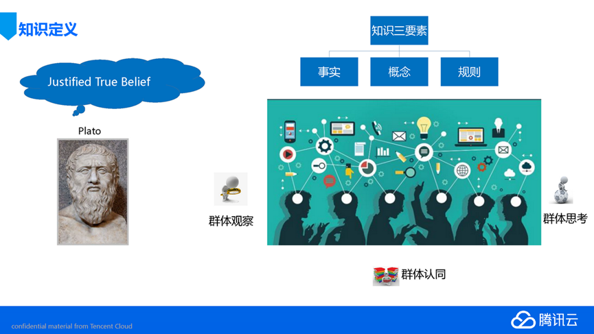

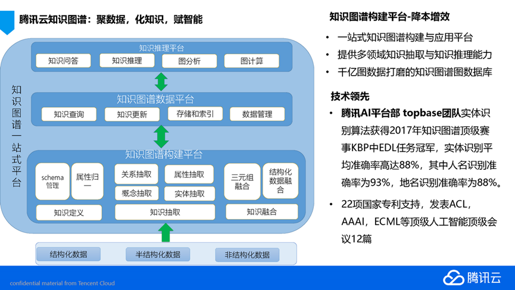

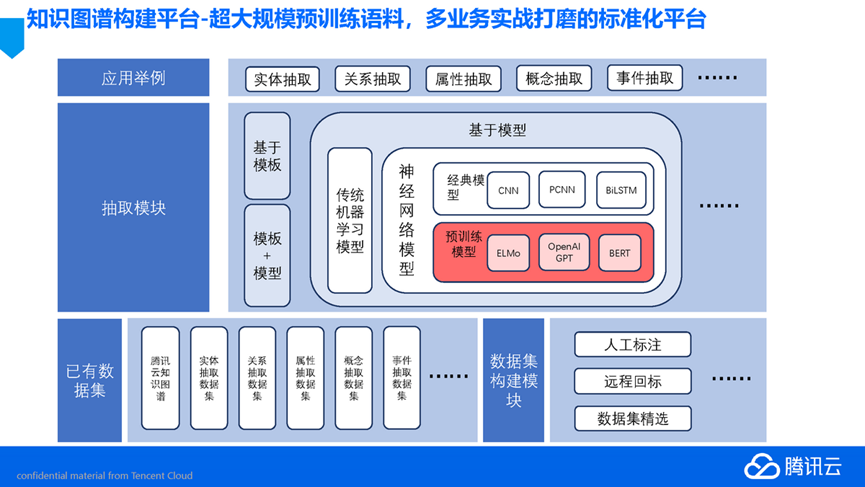

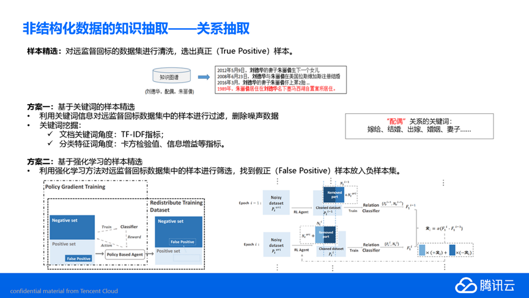

#上下位关系抽取

上下位关系：上下位关系是语言学概念。概括性较强的单词叫做特定性较强的单词的上位词（hypernym），特定性较强的单词叫做概括性较强的单词的下位词(hyponym)

i）	避免对预先编码的知识的需要；（ii）适用于广泛的文本。
表明了感兴趣的词汇关系

本文主要研究从大规模、开放领域的web文档中挖掘hypon-ymy（is-a）关系。利用非线性概率模型对模式匹配结果聚合中句子间的相关性进行建模。在此模型的基础上，设计了一套视频合成和传播算法。这大大提高了现有方法的结果质量。实验结果显示，在500万个lion网页和300个词的超词标签上，性能提高了20%以上第5页地图和R精度。

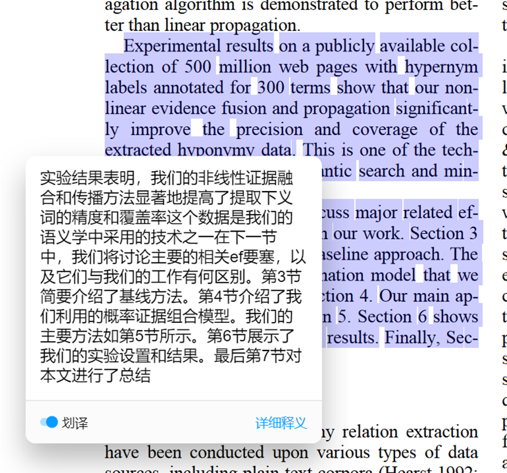

# TopBase knowledge graph 知识图谱构建  

万字解析TopBase
\
*[重要] https://www.ofweek.com/ai/2020-06/ART-201721-11000-30443440.html*

知识图谱是自然语言处理领域的核心技术，目前腾讯AI Lab建设了一个名叫TopBase的知识图谱，目前涵盖50多个领域如人物、音乐、影视、体育、诗词等，亿级实体，10亿级三元组，并已广泛应用到天天快报、微信看一看及微信搜索，和腾讯云小微等业务。

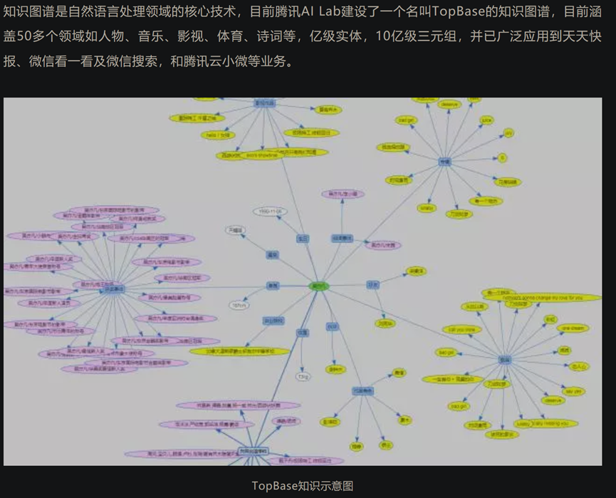

#### 2.TopBase知识库

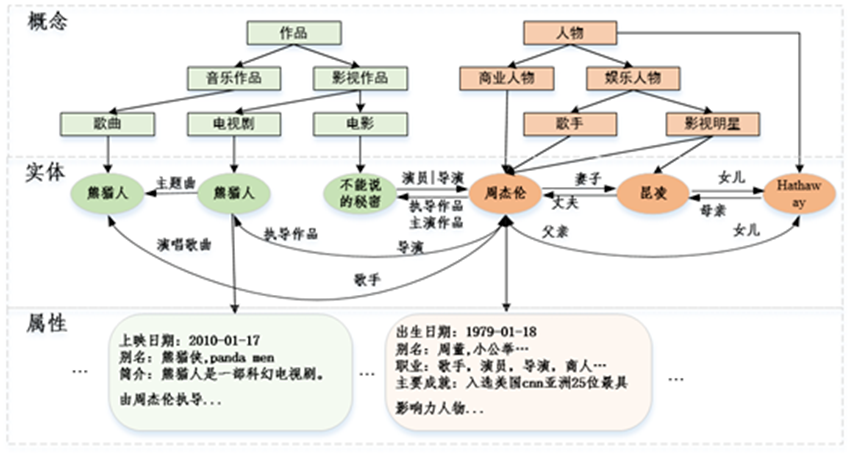

#### 3.TopBase技术框架

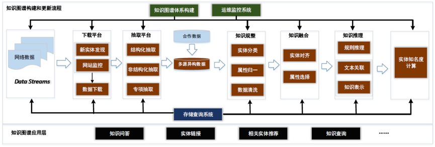

TopBase 的技术框架如图 2 所示，主要包括知识图谱体系构建，数据生产流程，运维监控系统以及存储查询系统。其中知识图谱体系是知识图谱的骨架，决定了我们采用什么样的方式来组织和表达知识，数据生产流程是知识图谱构建的核心内容，主要包括下载平台，抽取平台，知识规整模块，知识融合模块，知识推理模块，实体重要度计算模块等。Topbase 应用层涉及知识问答（基于 topbase 的 KB－QA 准确率超 90％），实体链接（2017 图谱顶级赛事 KBP 双料冠军），相关实体推荐等。

##### 3.1 下载平台－知识更新：下载平台是知识图谱获取源数据平台，其主要任务包括新实体的发现和新实体信息的下载。

##### 3.2．抽取平台－知识抽取：下载平台只负责爬取到网页的源代码内容，抽取平台需要从这些源码内容中生成结构化的知识，供后续流程进一步处理。

##### 3.3．知识规整：通过抽取平台以及合作伙伴提供的数据我们可以得到大量的多源异构数据。为了方便对多源数据进行融合，知识规整环节需要对数据进行规整处理，将各路数据映射到我们的知识体系中。

##### 3.4．知识融合：知识融合是对不同来源，不同结构的数据进行融合，其主要包括实体对齐和属性融合。

属性对其论文: http://cdmd.cnki.com.cn/Article/CDMD-10007-1018813492.htm

（属性对齐：旨在判断两个或多个属性是否可以表示同一个属性，把不同来源或名字相同但表征相同的属性进行信息融合，从而或者更丰富、更准确的信息。）
 
本文主要研究面向在线百科的实体对齐和属性对齐方法。实体对齐任务是指将不同数据源但是含义相同的多个实体进行对齐。属性对齐任务是指将表示同一概念的属性进行合并。针对实体对齐问题,本文提出了一种基于多视图融合的实体对齐方法。该方法的基本思想是同时利用两个视图的模型进行实体对齐,融合了自由文本视图和消息盒视图。它的优势是从多个角度解决实体对齐问题,考虑了多种视图的共同性和互补性。针对属性对齐问题,本文提出了一种基于词向量的属性对齐方法。该方法的基本思想是通过Word2vec及词向量技术去挖掘网页文本中的潜在语义信息,并融合对齐实体的相似属性。它的优势是有效地利用了深层语义信息和短文本知识,从而提升属性对齐的效果。本文实验数据选用百度百科、互动百科和维基百科三大在线百科的旅游景区、s保护动物、人物明星和世界国家四个主题的中文网页语料。评估指标采用的是准确率、召回率和F值。实验结果表明,基于多视图融合的聚类实体对齐方法优于单个视图的实体对齐方法,基于多视图融合的BIRCH层次聚类实体对齐方法优于基于多视图融合的LDA主题模型实体对齐方法和基于多视图融合的K-means聚类实体对齐方法;基于词向量的属性对齐方法优于基于相似距离的属性对齐方法。因此,实验结果表明了本文提出的实体对齐方法和属性对齐方法的有效性,该方法和所构建的实体和属性对齐知识可以广泛应用于构建知识图谱、知识库和知识计算引擎中。

##### 3.5 知识推理

知识推理：由于处理数据的不完备性，上述流程构建的知识图谱会存在知识缺失现象（实体缺失，属性缺失）。知识推理目的是利用已有的知识图谱数据去推理缺失的知识，从而将这些知识补全。此外，由于已获取的数据中可能存在噪声，所以知识推理还可以用于已有知识的噪声检测，净化图谱数据。

##### 3.6 实体知名度计算

实体知名度计算：最后，我们需要对每一个实体计算一个重要性分数，这样有助于更好的使用图谱数据。比如：名字叫李娜的人物有网球运动员，歌手，作家等，如果用户想通过图谱查询“李娜是谁”那么图谱应该返回最知名的李娜（网球运动员）。

#### 4.知识体系构建

1.知识体系的构建是指采用什么样的方式来组织和表达知识，核心是构建一个本体（或 schema）对目标知识进行描述。在这个本体中需要定义：1）知识的类别体系（如：图 1 中的人物类，娱乐人物，歌手等）；2）各类别体系下实体间所具有的关系和实体自身所具有的属性；3）不同关系或者属性的定义域，值域等约束信息（如：出生日期的属性值是 Date 类型，身高属性值应该是 Float 类型，简介应该是 String 类型等）。我们构建 Topbase 知识体系主要是以人工构建和自动挖掘的方式相结合，同时我们还大量借鉴现有的第三方知识体系或与之相关的资源，如：Schema．org、Dbpedia、大词林、百科（搜狗）等。知识体系构建的具体做法：

2.除了人工精心维护设计的顶层概念类别体系，我们还设计了一套上下位关系挖掘系统，用于自动化构建大量的细粒度概念（或称之为上位词），如：《不能说的秘密》还具有细粒度的概念：“青春校园爱情电影”，“穿越电影”。
定义了概念类别体系之后我们还需要为每一个类别定义关系和属性。关系用于描述不同实体间的联系，如：夫妻关系（连接两个人物实体），作品关系（连接人物和作品实体）等；例如所有歌手类实体应该都具有人物类的关系和属性。我们采用半自动的方式生成每个概念类别体系下的关系属性。我们通过获取百科 Infobox 信息，然后将实体分类到概念类别体系下，再针对各类别下的实体关系属性进行统计分析并人工审核之后确定该概念类别的关系属性。关系属性的定义也是一个不断完善积累的过程。

3.定义关系属性的约束信息可以保证数据的一致性，避免出现异常值，比如：年龄必须是 Int 类型且唯一（单值），演员作品的值是 String 类型且是多值。

下载平台－知识更新

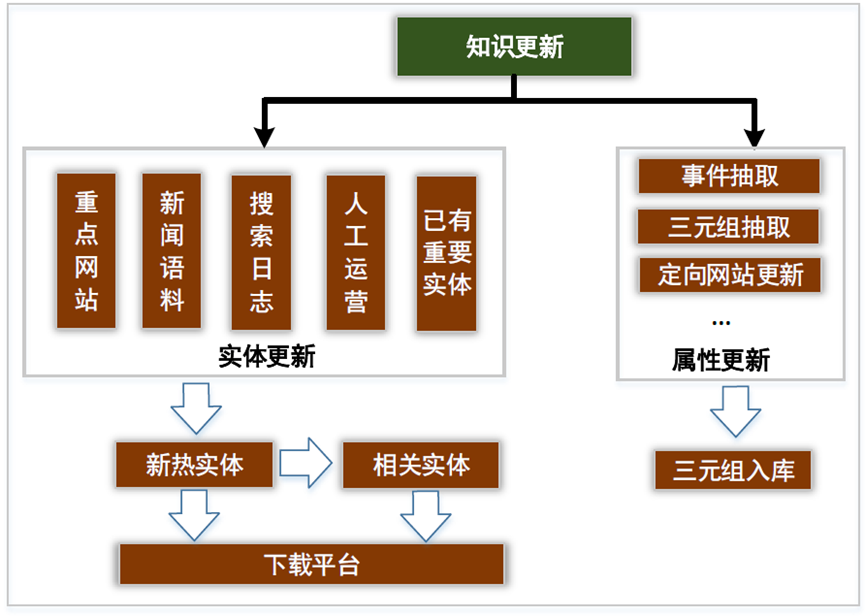

1．  针对热门实体信息的更新策略主要有：
从各大站点主页更新，定时遍历重点网站种子页，采用广搜的方式层层下载实体页面信息；
从新闻语料中更新，基于新闻正文文本中挖掘新实体，然后拼接实体名称生成百科 URL 下载；

2．  针对其他关系属性易变的情况，我们针对某些重要关系属性进行专项更新。如明星等知名人物的婚姻感情关系我们主要通过事件挖掘的方式及时更新，如：离婚事件会触发已有关系“妻子”“丈夫”变化为“前妻”“前夫”，恋爱事件会触发“男友”“女友”关系等。此外，基于非结构化抽取平台获得的三元组信息也有助于更新实体的关系属性。

抽取平台 － 知识抽取
Topbase 的抽取平台主要包括结构化抽取，非结构化抽取和专项抽取。其中结构化抽取主要负责抽取网页编辑者整理好的规则化知识，其准确率高，可以直接入库。由于结构化知识的局限性，大量的知识信息蕴含在纯文本内容中，因此非结构化抽取主要是从纯文本数据中挖掘知识弥补结构化抽取信息的不足。此外，某些重要的知识信息需要额外的设计专项策略进行抽取，比如：事件信息，上位词信息（概念），描述信息，别名信息等。这些重要的知识抽取我们统称专项抽取，针对不同专项的特点设计不同的抽取模块。

1．  结构化抽取平台
许多网站提供了大量的结构化数据，如（图 4 左）所示的百科 Infobox 信息。这种结构化知识很容易转化为三元组，如：“＜姚明，妻子，叶莉＞”。针对结构化数据的抽取，我们设计了基于 Xpath 解析的抽取平台，如（图 4 右）所示，我们只需要定义好抽取网页的种子页面如：baike．com，然后从网页源码中拷贝 Infobox 中属性的 xpath 路径即可实现结构化知识的自动抽取，入库。通过结构化抽取平台生成的数据准确率高，因此无需人工参与审核即可直接入库，它是知识图谱的重要数据来源。
\
2．  非结构化抽取平台
由于大量的知识是蕴含在纯文本中，为了弥补结构化抽取信息的不足，我们设计了非结构化抽取平台。非结构化抽取流程如图 5 所示：

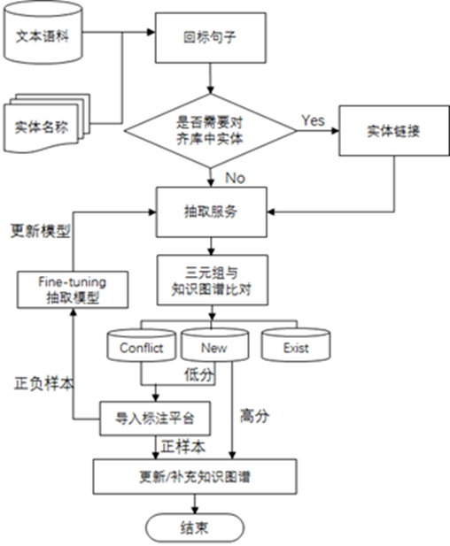
\
图5 Topbase非结构化抽取平台的技术框架

首先我们获取知识图谱中重要度高的实体名构建 Tri 树，然后回标新闻数据和百科正文数据，并将包含实体的句子作为候选抽取语料（新闻和百科数据需要区别对待，新闻数据往往包含最及时和最丰富的三元组信息，百科数据质量高，包含准确的知识，且百科摘要或正文描述相对简单，抽取结果的准确率高）。

然后，我们利用 Topbase 的实体链接服务，将匹配上的实体链接到知识库的已有实体中，避免了后期的数据融合。比如：实体“李娜”匹配到一句话是“歌手李娜最终归一了佛门”，那么这句话中的李娜会对应到知识库中的歌手李娜，而不是网球李娜，从这句话中抽取的结果只会影响歌手李娜的。实体链接之后，我们将候选语料送入我们的抽取服务，得到实体的三元组信息。

最后，三元组结果会和知识库中已有的三元组数据进行匹配并给每一个抽取得到的三元组结果进行置信度打分，如果知识库已经存在该三元组信息则过滤，如果知识库中三元组和抽取得到的三元组发生冲突则进入众包标注平台，如果三元组是新增的知识则根据他们的分值决定是否可以直接入库或者送入标注平台。此外，标注平台的结果数据会加入到抽取服务中 Fine－tune 模型，不断提升抽取模型的能力。

上述流程中的核心是抽取服务模块，它是非结构化抽取策略的集合。抽取服务构建流程如图 6 所示，其主要包括离线模型构建部分以及在线服务部分。离线模型构建的重点主要在于如何利用远监督的方式构建抽取模型的训练数据以及训练抽取模型。在线流程重点是如何针对输入的文本进行预处理，走不同的抽取策略，以及抽取结果的后处理。针对不同属性信息的特点，抽取策略主要可以简单归纳为三大类方法：

基于规则的抽取模块：有些属性具有很强的模板（规则）性质，所以可以通过人工简单的配置一些模板规则就可以获得高准确率的三元组结果。一般百科摘要文本内容描述规范，适合于规则抽取的输入数据源。此外，适用于规则抽取的属性主要有上位词，别名，地理位置，人物描述 tag 等。当然，规则模块召回有限往往还得搭配模型抽取模块，但是规则模块结果适合直接入库，无需标注人员审核。

基于 mention 识别(mention就是粗略的分类，即知道这个ngram是个实体，但是不知道其是哪一类)＋关系分类模块：基本思想是先用 NER 或者词典匹配等方式识别出句子中的 mention，然后利用已有的实体信息以及识别出来的 mention 进行属性分类。举例：给定识别出 mention 的句子“＜org＞腾讯＜／org＞公司是由＜per＞马化腾＜／per＞创立的。”，用 schema 对输入进行调整，一种情况是 org 作为头实体，per 作为尾实体，那么该样本的分类结果是关系“创始人”，另一种情况是 per 作为头实体，org 作为尾实体，那么该样本的分类结果是“所属公司”，所以最终可以得到三元组＜腾讯，创始人，马化腾＞和＜马化腾，所属公司，腾讯＞。一般人物，地点，机构，影视剧，时间等实体可以利用 qqseg－ner 识别。词典性质的实体如：职业，名族，国籍，性别等适合于词典匹配的方式识别。

基于序列标注模块：此外，还有许多属性值是无法进行 mention 识别，因此针对这类属性，我们采用一种序列标注的联合抽取方式来同时识别实体的属性值以及属性。这类属性主要有人物的“主要成就”信息，人物的描述 tag 信息，以及一些数值型属性信息。

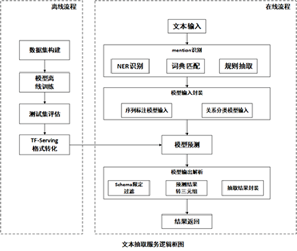
\
图6 Topbase的非结构化抽取服务

# 实体对齐 属性对齐 实体消岐

https://blog.csdn.net/broccoli2/article/details/102531077

什么是实体对齐、实体消歧？

实体对齐旨在判断两个或者多个不同信息来源的实体是否为指向真实世界中同一个对象。如果多个实体表征同一个对象，则在这些实体之间构建对齐关系，同时对实体包含的信息进行融合和聚集。
 
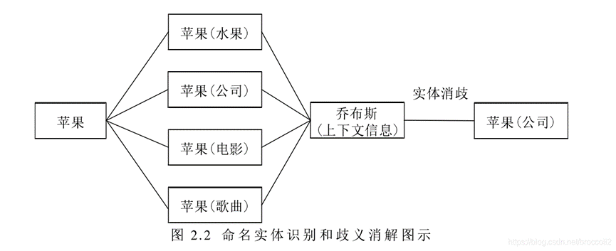

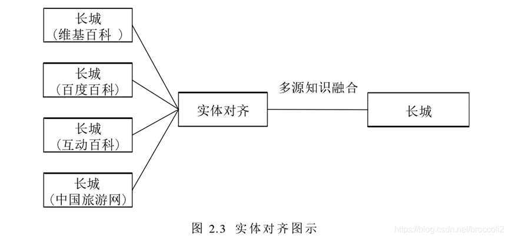

实体消歧：根据上下文信息实现消除一词多义的现象。
 
属性对齐：旨在判断两个或多个属性是否可以表示同一个属性，把不同来源或名字相同但表征相同的属性进行信息融合，从而或者更丰富、更准确的信息。
 
参考：实体和属性对齐方法的研究与实现（硕士论文）

----------------------------------------------------------------------------
----------------------------------------------------------------------------
----------------------------------------------------------------------------

# Programming Notes End

### Markdown

For more details see [GitHub Flavored Markdown](https://guides.github.com/features/mastering-markdown/).

### Jekyll Themes

Your Pages site will use the layout and styles from the Jekyll theme you have selected in your [repository settings](https://github.com/RogerJTX/RogerJTX.github.io/settings). The name of this theme is saved in the Jekyll `_config.yml` configuration file.

    